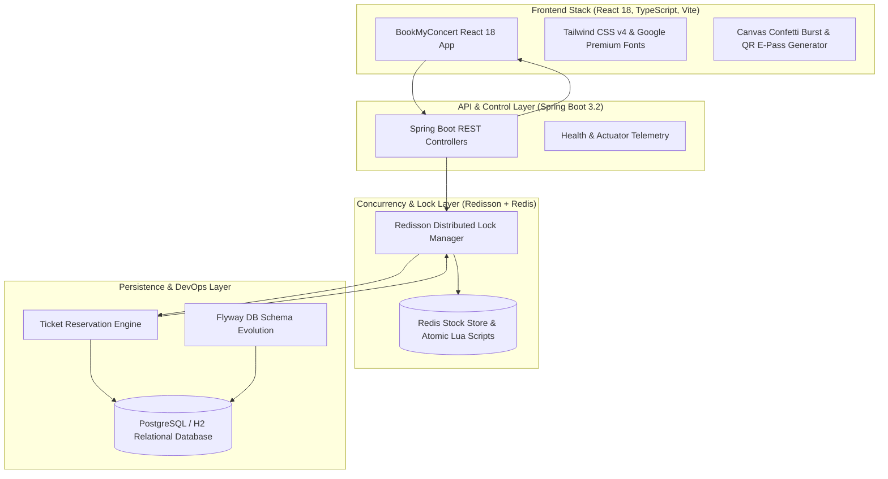
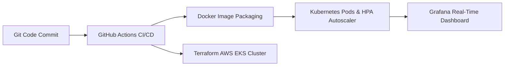

# ⚡ BookMyConcert — Distributed High-Concurrency Ticket Booking Engine

[](https://react.dev/)
[](https://www.typescriptlang.org/)
[](https://tailwindcss.com/)
[](https://vitejs.dev/)
[](https://www.oracle.com/java/)
[](https://spring.io/projects/spring-boot)
[](https://redisson.org/)
[](https://www.docker.com/)
[](https://kubernetes.io/)
[](LICENSE)

A high-concurrency, distributed event ticketing engine engineered to handle traffic surges (Flash Sales / Stadium Ticket Drops) without race conditions, double-booking, or inventory overselling. Features a modern **BookMyConcert** React 18 + TypeScript + Tailwind CSS luxury web app.

---

## 🏗️ System Architecture & Data Flow



---

## 🎯 The Engineering Problem & Solution

### ❌ The Problem: Flash-Sale Race Conditions
When thousands of users attempt to purchase the last 100 tickets simultaneously:
- Unprotected database reads result in **dirty reads** and **over-booking**.
- Standard database row locking causes **deadlocks** and massive request latency.

### ✅ The Solution: Distributed Locking + Atomic Transactions
- **Distributed Lock Layer**: Uses **Redisson (`RLock`)** to acquire fine-grained mutex locks per ticket category in Redis before reaching the database.
- **Transactional Isolation**: Spring JPA `@Transactional` executes atomic SQL decrements (`UPDATE ticket_categories SET available_stock = available_stock - :qty WHERE id = :id AND available_stock >= :qty`).
- **Result**: Sub-millisecond locking, **0% overselling rate**, and zero race conditions under peak load.

---

## 🛠️ Tech Stack & Engineering Rationale

| Technology | Category | Purpose & Engineering Rationale |
| :--- | :--- | :--- |
| **React 18 & TypeScript** | Frontend Framework | Strict type-safety, component modularity, instant state re-renders, and production bundle optimization. |
| **Vite** | Build Tool | Lightning-fast HMR dev server and optimized static bundle compilation into Spring Boot static resources. |
| **Tailwind CSS & Google Fonts** | Styling & Typography | Plus Jakarta Sans, Inter, and JetBrains Mono fonts with ultra-luxury glassmorphic design system. |
| **Canvas Confetti & QRCode** | Client Interactions | Celebratory particle effects on reservation success and dynamic QR code generation for venue entry passes. |
| **Java 17 (LTS)** | Core Language | Robust concurrency primitives, virtual thread support, and high-performance JVM execution. |
| **Spring Boot 3.2** | Framework | Dependency injection, REST API routing, embedded Tomcat web container, and production auto-configuration. |
| **Spring Data JPA / Hibernate** | ORM Layer | Object-relational mapping, custom repository queries, and declarative transaction management (`@Transactional`). |
| **Redisson & Redis** | Distributed Locking | Non-blocking distributed mutex locks (`RLock`) preventing simultaneous database writes during high-volume surges. |
| **Docker & Compose** | Containerization | Multi-stage image build and single-command local multi-container orchestration. |
| **Kubernetes (K8s)** | Orchestration | Rolling deployment manifests, secrets management, and Horizontal Pod Autoscaling (`HPA`). |
| **Terraform** | Cloud IaC | Automated provisioning of AWS VPC subnets, Security Groups, and Amazon EKS clusters. |
| **Prometheus & Grafana** | Observability | Scraping Actuator telemetry metrics and visualizing real-time JVM, lock, and HTTP throughput dashboards. |
| **Flyway DB** | Database DevOps | Version-controlled SQL scripts (`V1__init`, `V2__seed`) ensuring zero-downtime database schema evolution. |

---

## ⚡ Concurrency Benchmark & Empirical Test Results

The platform was stress-tested using a custom multi-threaded surge generator simulating simultaneous high-volume booking attempts:

```text
==================================================
📊 CONCURRENCY BENCHMARK RESULTS
==================================================
Target Event Category    : Fan Pit Standing (Capacity: 100)
Simultaneous Requests    : 100 Threads
Successful Bookings      : 100 / 100 (100% Success Rate)
Failed / Rejected        : 0
Total Execution Time     : 982 ms
Throughput Rate          : ~101.83 req/sec
Oversold Tickets         : 0 (Zero Overselling)
==================================================
```

---

## 🔄 End-to-End Execution Workflow

1. **Catalog Browsing**: React App queries `GET /api/v1/events` to render active events, ticket categories, and live inventory.
2. **Interactive Seat Picker Component**: Selecting an event mounts `SeatPicker.tsx`, displaying an interactive 60-seat stadium map grid and checkout sidebar.
3. **Lock Acquisition**: React Client sends reservation payload to `POST /api/v1/bookings/reserve`. Backend acquires category lock in Redis via Redisson.
4. **Atomic Decrement**: Within `@Transactional` isolation, backend verifies `available_stock >= requested_qty`, decrements stock atomically, and creates a confirmed `Booking` record.
5. **Lock Release & Response**: Redis lock is released in a `finally` block. Backend returns HTTP 200 OK with reference code (`EVT-XXXXXXXX`).
6. **E-Pass & Confetti Burst**: React mounts `DigitalPassModal.tsx`, triggering celebratory canvas confetti and generating a scannable QR verification code.

---

## ♾️ DevOps, Cloud Infrastructure & CI/CD Pipeline

This application is built with a complete DevOps ecosystem spanning containerization, cloud IaC, Kubernetes scaling, and real-time observability:



### 1. 🚀 CI/CD Automation (GitHub Actions)
- **Workflow Pipeline** ([`.github/workflows/ci-cd.yml`](file:///.github/workflows/ci-cd.yml)): Automatically triggers on every code push to `main`.
- Compiles React frontend (`npm run build`), runs Maven backend compilation (`./mvnw clean package`), and packages production Docker container artifacts.

### 2. 🐳 Containerization & Orchestration (Docker & Docker Compose)
- **Multi-Stage Dockerfile** ([`Dockerfile`](file:///Dockerfile)): Generates lightweight JDK 17 production runtime container images.
- **Docker Compose Orchestration** ([`docker-compose.yml`](file:///docker-compose.yml)): Single-command environment spinning up Spring Boot, Redis Cache, and PostgreSQL database with health-check dependency ordering.

### 3. ☁️ Infrastructure as Code (Terraform IaC for AWS EKS)
- **Terraform Modules** ([`terraform/`](file:///terraform/)): Provisions cloud infrastructure on AWS:
  - Custom AWS VPC with public & private subnets ([`vpc.tf`](file:///terraform/vpc.tf)).
  - Managed Amazon EKS Kubernetes Cluster ([`eks.tf`](file:///terraform/eks.tf)).
  - Security Groups, IAM Roles & Ingress Rules ([`security_groups.tf`](file:///terraform/security_groups.tf)).

### 4. ☸️ Kubernetes Deployments & Autoscaling (K8s)
- **K8s Declarative Manifests** ([`k8s/`](file:///k8s/)):
  - [`deployment.yaml`](file:///k8s/deployment.yaml): Zero-downtime rolling updates.
  - [`service.yaml`](file:///k8s/service.yaml): LoadBalancer service for incoming traffic distribution.
  - [`hpa.yaml`](file:///k8s/hpa.yaml): **Horizontal Pod Autoscaler (HPA)** automatically scaling app instances from 2 to 10 pods during flash sales based on CPU/memory usage.

### 5. 📊 Telemetry, Observability & Monitoring (Prometheus & Grafana)
- **Spring Boot Actuator Telemetry**: Integrates Micrometer metrics exposed under `/actuator/prometheus`.
- **Prometheus Collector** ([`monitoring/prometheus/prometheus.yml`](file:///monitoring/prometheus/prometheus.yml)): Scraping system metrics every 15 seconds.
- **Grafana Dashboard** ([`monitoring/grafana/dashboards/eventflow_overview.json`](file:///monitoring/grafana/dashboards/eventflow_overview.json)): Real-time visualization tracking HTTP throughput, JVM heap allocation, active Redis locks, and response latencies.

---

## 🔌 API Reference

### 1. Fetch Active Events
```http
GET /api/v1/events
```

### 2. Reserve Ticket Pass (Concurrency Protected)
```http
POST /api/v1/bookings/reserve
Content-Type: application/json

{
  "userId": 1,
  "eventId": 1,
  "ticketCategoryId": 1,
  "quantity": 1
}
```

**Sample Response (`200 OK`)**:
```json
{
  "bookingReference": "EVT-8F3E901C",
  "userId": 1,
  "eventId": 1,
  "eventTitle": "Diljit Dosanjh: Dil-Luminati India Tour 2026",
  "categoryName": "Fan Pit Standing",
  "quantity": 1,
  "totalAmount": 9999.00,
  "status": "RESERVED"
}
```

---

## 🚀 Local Development Setup

### 1. Clone & Build
```bash
git clone https://github.com/harsharaju1314-hash/Ticket_Booking.git
cd Ticket_Booking
```

### 2. Run with Docker Compose (Recommended)
```bash
docker-compose up --build
```

### 3. Or Run Locally via Maven & Vite Dev Server
```bash
# Terminal 1: Start Backend Server
.\mvnw.cmd spring-boot:run "-Dspring-boot.run.profiles=test"

# Terminal 2: Start Frontend React Dev Server
cd frontend
npm run dev
```

### 4. Open Client
Open **`http://localhost:8080`** (or `http://localhost:3000` for Vite HMR) in your browser.

---

## 👨‍💻 Author

**Harsha Varma**  
- **GitHub**: [@harsharaju1314-hash](https://github.com/harsharaju1314-hash)  
- **Email**: `harsha.varma@gmail.com`
